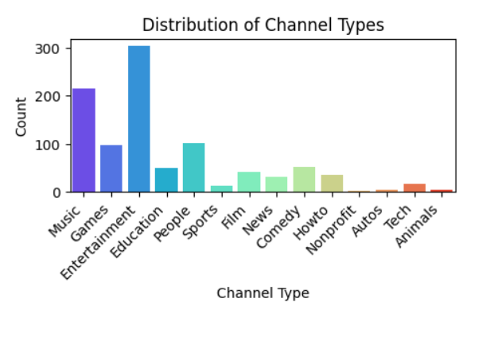
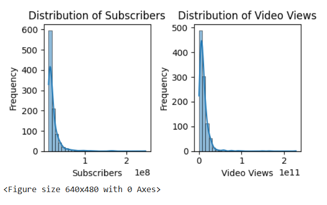
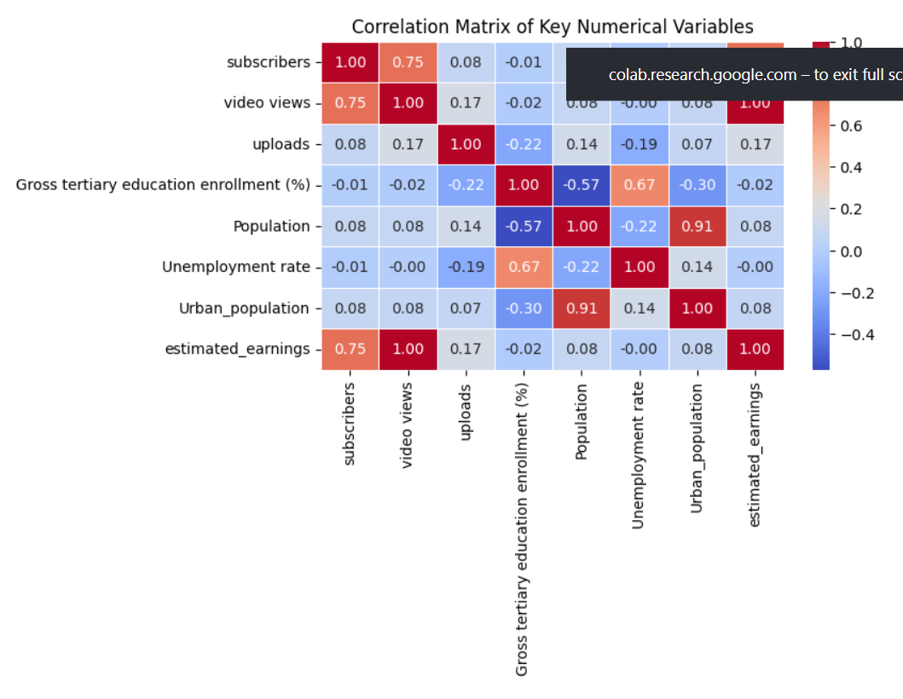
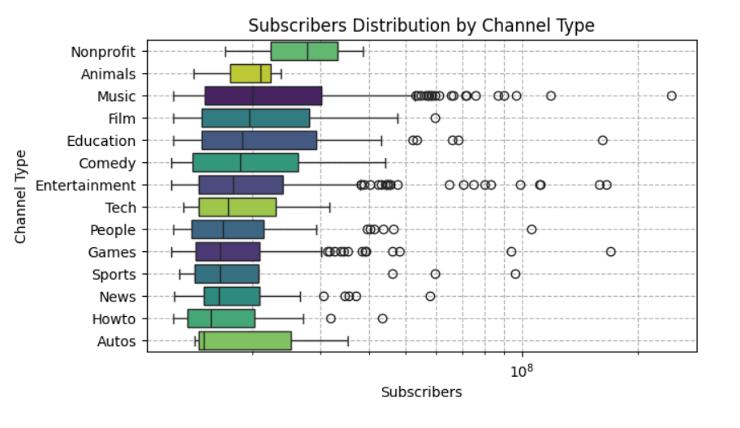
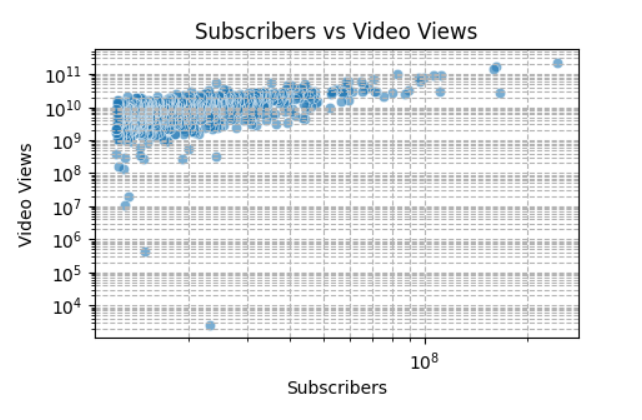

# 📊 YouTube Trending Analysis

## 📌 Project Overview

This project performs Exploratory Data Analysis (EDA) on global YouTube statistics using Python and popular data analysis libraries.

The objective is to understand trends in subscribers, video views, uploads, earnings, and audience engagement through data preprocessing and visualization.

This project was created as part of my Data Analytics and Placement Portfolio to strengthen practical skills in Python and data analysis.

---

## 🚀 Technologies Used

* Python
* Pandas
* NumPy
* Matplotlib
* Seaborn
* Jupyter Notebook

---

## 📂 Project Structure

```
```text
youtube-trending-analysis/
│
├── data/
│   └── Global YouTube Statistics.csv
│
├── notebooks/
│   ├── 01_Data_Preprocessing.ipynb
│   └── 02_Exploratory_Data_Analysis.ipynb
│
├── images/
│   ├── Channel type distribution.png
│   ├── Distribution of subscribers.png
│   ├── correlation_heatmap.png
│   ├── subscribers distribution by channel type.png
│   └── video_views_distribution.png
│
├── README.md
├── requirements.txt
├── .gitignore
└── LICENSE
```


---

## 📈 Project Workflow

1. Data Loading
2. Data Cleaning
3. Handling Missing Values
4. Exploratory Data Analysis
5. Distribution Analysis
6. Correlation Analysis
7. Data Visualization
8. Insights Generation

---

## 📊 Sample Analysis

The project includes visualizations and statistical analysis for:

* Subscriber distribution
* Video views distribution
* Upload statistics
* Correlation heatmaps
* Channel-level insights
* Basic exploratory visualizations

---
## 📸 Sample Visualizations

### Channel Type Distribution



### Distribution of Subscribers



### Correlation Heatmap



### Subscribers Distribution by Channel Type



### Video Views Distribution



---
## 🔍 Key Insights

* 📊 Certain channel types dominate in subscriber count, showing clear content popularity trends.
* 👀 Higher video views are generally associated with higher subscriber counts, indicating engagement correlation.
* 📈 Some channels have high views but relatively low subscribers, suggesting viral content behavior.
* 📉 Subscriber distribution is highly skewed, meaning a small number of channels control most of the audience.
* 🧠 Correlation heatmap shows strong positive relationship between subscribers and total views.

---

## 🎯 Conclusion

This project helped me understand how real-world YouTube data behaves and how trends can be analyzed using Python.
It strengthened my skills in data cleaning, visualization, and deriving insights from raw datasets.

---

## 🎯 Learning Outcomes

* Data preprocessing using Pandas
* Handling missing values
* Exploratory Data Analysis (EDA)
* Data visualization using Matplotlib and Seaborn
* Understanding real-world datasets
* Creating reproducible data analysis workflows

---

## 📌 Future Improvements

* Interactive dashboard
* Machine Learning prediction models
* Time-series trend analysis
* Power BI visualization
* Streamlit deployment

---

## 👩‍💻 Author

**Tharunya**

This project was developed for learning purposes and as part of my placement portfolio.

